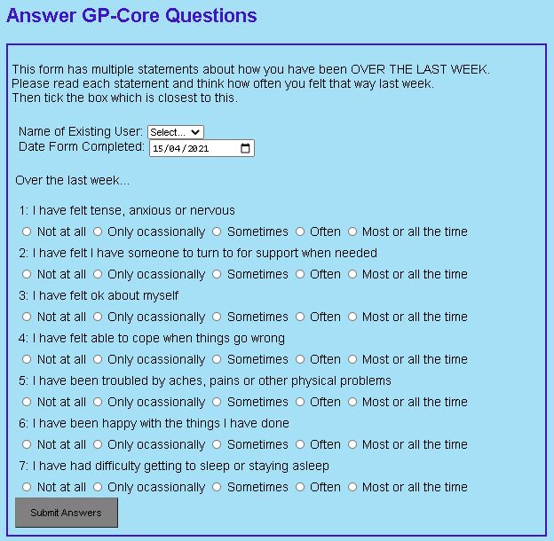

# Core Questions Form - Using PHP & MVC

## About
This will be a web form where you can submit answers to the 'GP-Core Questions', which is used to report subjective wellbeing. 

**NB: This repo is very much a work in progress.**

It uses the LAMP stack, and will have basic CRUD functionality, storing data in a MYSQL db.

Its been cloned from an existing To Do app based on the Slim 4 framework.

It uses Routing, the Dependency Injection Container, Factories, Controllers & Views to implement CRUD funtionality

## Live Demo
This To Do app is live here - (coming soon, hopefully by the end of April 2021)

## End User Features
- View a list of existing users (added 5 April)
- Add a new user to the DB (added 5 April)
- View all existing Core Questions (added 5 April)
- Answer the Core Questions and submit the form to save the details to the DB (added 8 April)
- View user history data ie previous dates & score (added 9 April)
- View dynamic graph of previous dates & scores (added 11 April) **NEW!**

## Screenshots
Users: 

Questions: 

User History Graph:

<!-- core_questions_app_questions.PNG
core_questions_app_users.PNG
core_questions_app_graph.PNG -->

## To Install & Run Locally
1. Clone repo locally & `cd` to directory
2. Run `composer install`
3. Create a new MYSQL database called `corelifedb`
4. Adjust the DB connection details in the file `app/settings.php` according to your local setup
5. Import the file `db/core_questions_db.sql` into your database and run it to create multiple tables and add some example data
6. Run this from a normal command prompt to start the app `composer start`
7. Access this url in your browser `http://localhost:8087/`

