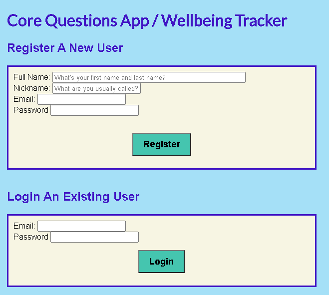
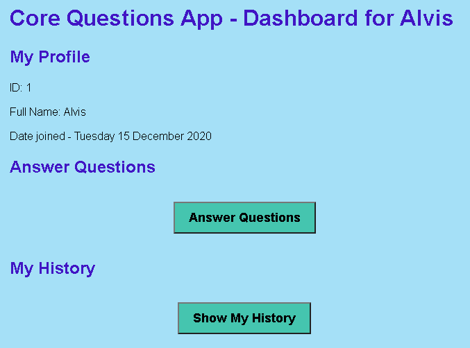
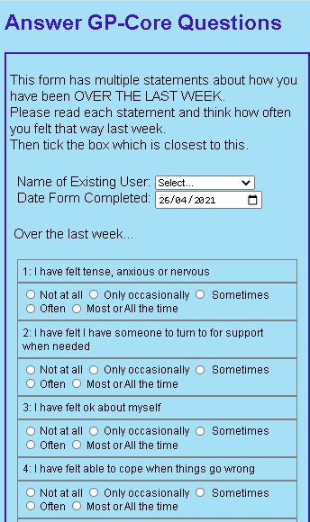
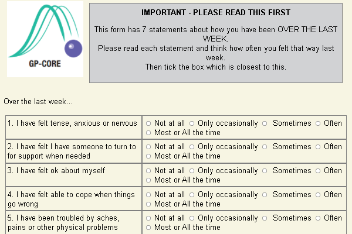
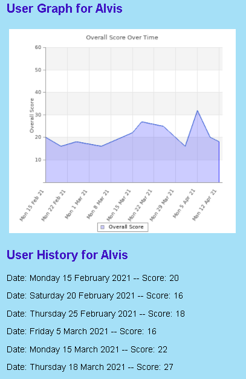

# Core Questions Form - Using PHP & MVC

## About
This is a web form where you can submit answers to the 'GP-Core Questions', which is used to report subjective wellbeing. 

**NB: This repo is very much a work in progress - as of 16 May currently working on adding Register & Login User functionality)**

It uses the LAMP stack, and will have basic CRUD functionality, storing data in a MYSQL db.

Its been cloned from an existing To Do app based on the Slim 4 framework and MVC Pattern.

It uses Routing, the Dependency Injection Container, Factories, Controllers & Views to implement CRUD funtionality

NB: CORE forms are owned, created & copyrighted by -
© CORE System Trust: https://www.coresystemtrust.org.uk/copyright.pdf

## Live Demo
This Wellbeing Tracking Form is live here - (coming soon, hopefully by end of May 2021)

## End User Features
- View a list of existing users (added 5 April)
- Add a new user to the DB (added 5 April)
- View all existing Core Questions (added 5 April)
- Answer the Core Questions and submit the form to save the details to the DB (added 8 April)
- View user history data ie previous dates & score (added 9 April)
- View dynamic graph of previous dates & scores (added 11 April)
- Improved layout of Core Questions form (Answer options now move below each Question on smaller screens) - added 26 April
- Improve formatting of GP-Core Questions form, added all GP-CORE questions to DB and added copyright info for Core Systems Trust - added 2 May **NEW!**
- Coming Soon - Restructuring the app so it has User Registration and Login options on the homepage, which leads to the user Dashboard. Also creating the functionality to Register & Login, using hashed passwords & tokens.

## Screenshots
Register User or Login: 

User Dashboard:

Core Questions Form: 

<!--  -->
<!--  -->

User History Graph:

## To Install & Run Locally
1. Clone repo locally & `cd` to directory
2. Run `composer install`
3. Create a new MYSQL database called `corelifedb`
4. Adjust the DB connection details in the file `app/settings.php` according to your local setup
5. Import the file `db/core_questions_db.sql` into your database and run it to create multiple tables and add some example data
6. Run this from a normal command prompt to start the app `composer start`
7. Access this url in your browser `http://localhost:8087/`

