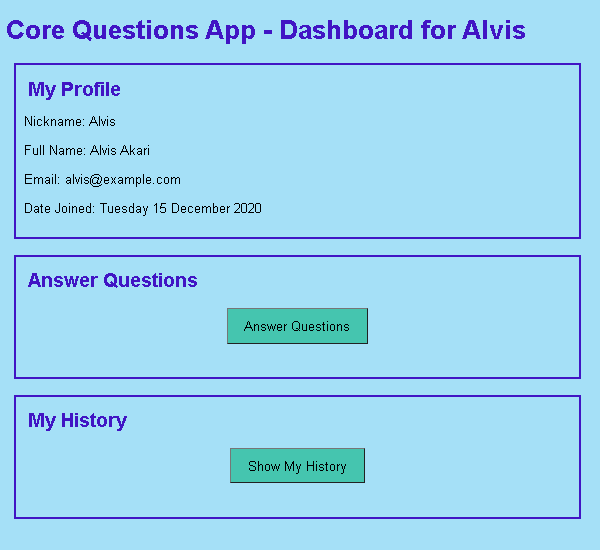

# Core Questions Form - Using PHP & MVC

## About
This is a web form where you can submit answers to the 'GP-Core Questions', which is used to report subjective wellbeing. 

**NB: This repo is very much a work in progress - as of 14 June currently working on adding sessions to handle Login and Logout and protect the routes**

It uses the WAMP stack, and will have basic CRUD functionality, storing data in a MYSQL db. It uses Routing, the Dependency Injection Container, Factories, Controllers & Views to implement CRUD funtionality

NB: CORE forms are owned, created & copyrighted by -
© CORE System Trust: https://www.coresystemtrust.org.uk/copyright.pdf

## Live Demo
This Wellbeing Tracking Form wil be live here - (coming soon, hopefully by end of August 2021) - https://davin2020.github.io/wellbeing/default.html

## End User Features
- View a list of existing users (added 5 April)
- Add a new user to the DB (added 5 April)
- View all existing Core Questions (added 5 April)
- Answer the Core Questions and submit the form to save the details to the DB (added 8 April)
- View user history data ie previous dates & score (added 9 April)
- View dynamic graph of previous dates & scores (added 11 April)
- Improved layout of Core Questions form (Answer options now move below each Question on smaller screens) - added 26 April
- Improve formatting of GP-Core Questions form, added all GP-CORE questions to DB and added copyright info for Core Systems Trust (added 2 May)
created feature to calculate & save Mean Score when question form is …
…submitted (added 11 May)

<!-- created Ddashabord page 11 may
created QuestionFormController class & Factory; created question_form…
….php page & added existing questions
put questions on their own page 11 may 
updated response url so it redirects to dashboard.php for current use…
…r with success message - now redirects to history page as of may 14
created new /admin route
created new index page to contain login form and register form only (…
…ie add new user) - may13
added more fields to user table - replaced db field called name with nickname in users table across mul…
…tiple files 15may
created getUserByEmail() using better fetch option of FETCH_ASSOC 16may
added loginUser() to find user and verify hashed password 17may
updated user table with example data for fullname, email and hashed p…
…asswords may 20

added fields fullname & email to getUserFromID() when getting user fr…
…om db and changed fetch mode to ASSOC array 20may
updated dashboard.php to display fullname & email
added section tags to dashboard page and styled them with a border, a…
…lso restyled buttons

created css class graph_image to display at 100% width on show_histor…
…y.php until max screen width of 960px then 75% after that; also added section tags may22
removed link to Admin page, updated add name, set fullname html field size…
… to 50

review commits in main_comments from 20 may

/admini links no longer work eg to dashboard , but to history does work
TODO remove vardumps on dashbord page
check current session expiry timeframe
need better screnshot of answer question page to include blue & beige
beeter screenshot of login page - remove vardumps first and make full name field longer?
check graph size on wider browsers
dahsbboard page contains logout button, need screenshot of that
-->

- Restructured the app so it has User Registration and Login options on the homepage, which leads to the user's Dashboard page. Also created the functionality to Register & Login, using hashed passwords (added 15 & 16 May)
- Coming Soon - Adding sessions to handle login and logout and protect the routes (added 14 June) **NEW!**

## Screenshots
Register User or Login: 

User Dashboard:

<!--  -->

Core Questions Form: 

<!--  -->
<!--  -->

User History Graph:

## To Install & Run Locally
1. Clone repo locally & `cd` to directory
2. Run `composer install`
3. Create a new MYSQL database called `corelifedb`
4. Adjust the DB connection details in the file `app/settings.php` according to your local setup
5. Import the file `db/core_questions_db.sql` into your database and run it to create multiple tables and add some example data
6. Run this from a normal command prompt to start the app `composer start`
7. Access this url in your browser `http://localhost:8087/`

