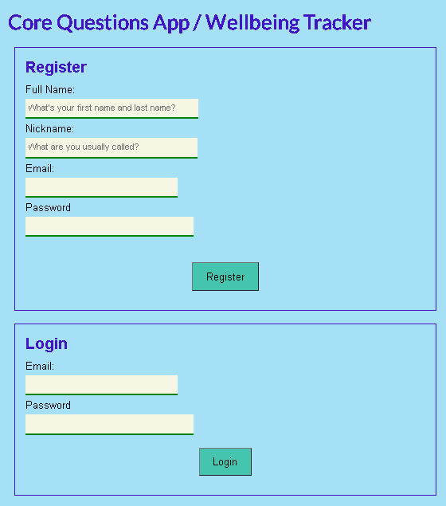

# Wellbeing Tracker (CORE Questions Form)

## About
This is a web form where you can submit answers to the 'GP-CORE Questions', which is used to report subjective wellbeing. Results are plotted on a graph so you can see your progress over time

**NB: This repo is very much a work in progress, with features in branches that aren't ready for main yet**

This project uses the WAMP stack, Slim 4 framwork and MVC pattern (Routing, the Dependency Injection Container, Factories, Controllers & Views) to implement CRUD funtionality

NB: CORE forms are owned, created & copyrighted by -
© CORE System Trust: https://www.coresystemtrust.org.uk/copyright.pdf

## Live Demo
This Wellbeing Tracking Form wil be live here - (coming soon, hopefully by end of August 2021) - https://davin2020.github.io/wellbeing/default.html

## End User Features
- View a list of existing users (added 5 April)
- Add a new user to the DB (added 5 April)
- View all existing CORE Questions (added 5 April)
- Answer the Core Questions and submit the form to save the details to the DB (added 8 April)
- View user history data ie previous dates & scores (added 9 April)
- View dynamic graph of previous dates & scores (added 11 April)
- Improved layout of CORE Questions form (Answer options now move below each Question on smaller screens) - added 26 April
- Improved formatting of Question Form, added all GP-CORE questions to DB and added copyright info for Core Systems Trust (added 2 May)
- Moved Question Form to its own page and calculated & saved Mean Score when form is submitted (added 11 May)
- Restructured the app so that User Registration and Login options are on the homepage. After logging in, the user is taken to the Dashboard page, where they can access the Questions or History pages (added 13 May)
- Added more user fields to DB (fullname, email, password). Created  functionality to Register & Login users, using hashed passwords (added 17 May)
- Added sessions to restrict logged in users to only access their own data and added Logout button - (added 14 June, needs more testing) **NEW!**

## Screenshots
Register User or Login: 

User Dashboard:

Core Questions Form: 

User History Graph:

## To Install & Run Locally
1. Clone repo locally & `cd` to directory
2. Run `composer install`
3. Create a new MYSQL database called `corelifedb`
4. Adjust the DB connection details in the file `app/settings.php` according to your local setup
5. Import the file `db/core_questions_db.sql` into your database and run it to create multiple tables and add some example data
6. Run this from a normal command prompt to start the app `composer start`
7. Access this url in your browser `http://localhost:8087/`

